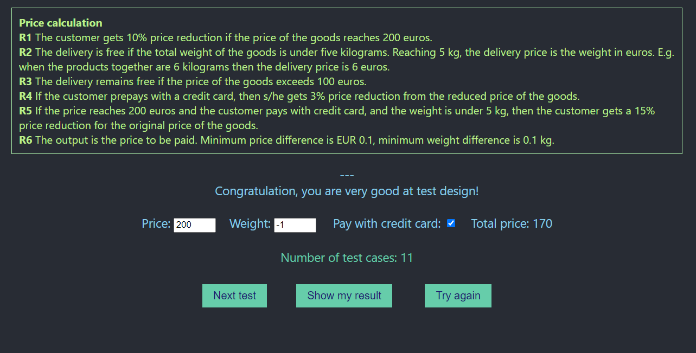

# Execution Report

**Project:** price-calculation  
**Tester:** Alexandr Gusev  
**Execution Period:** September 2026  
**Build Version:** 1.0

---

## Summary

| Metric           | Count |
|------------------|-------|
| Total test cases | 11    |
| Executed         | 11    |
| Pass             | 8     |
| Fail             | 3     |
| Blocked          | 0     |
| Pass rate        | 73%   |

---

## Execution Report
| Case      | Price | Weight | Pay with credit card | Expected total price | Status |
|-----------|-------|--------|----------------------|----------------------|--------|
| TC-PC-001 | 99    | 4.9    | Yes                  | 96                   | ✅      |
| TC-PC-002 | 100   | 5      | No                   | 105                  | ✅      |
| TC-PC-003 | 101   | 4.9    | Yes                  | 98                   | ✅      |
| TC-PC-004 | 199   | 5      | No                   | 199                  | ✅      |
| TC-PC-005 | 200   | 4.9    | Yes                  | 170                  | ✅      |
| TC-PC-006 | 200   | 5      | Yes                  | 174.6                | ✅      |
| TC-PC-007 | 201   | 6      | No                   | 180.9                | ✅      |
| TC-PC-008 | abc   | 5      | No                   | NaN                  | ✅      |
| TC-PC-009 | 100   | abc    | Yes                  | NaN                  | ❌      |
| TC-PC-010 | -1    | 4.9    | No                   | Validation Error     | ❌      |
| TC-PC-011 | 200   | -1     | Yes                  | Validation Error     | ❌      |

---

## Result
