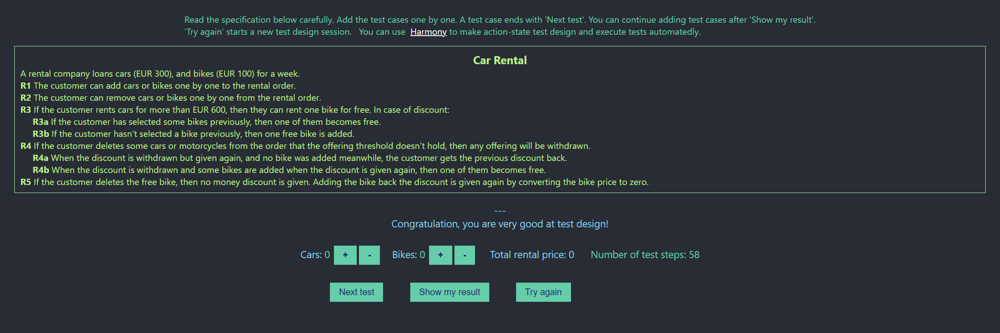

# Execution Report

**Project:** car-rental   
**Tester:** Alexandr Gusev  
**Execution Period:** October 2026  
**Build Version:** 1.0

---

## Summary

| Metric           | Count |
|------------------|-------|
| Total test cases | 14    |
| Executed         | 14    |
| Pass             | 14    |
| Fail             | 0     |
| Blocked          | 0     |
| Pass rate        | 100%  |

---

## Execution Report

| Case    | Preconditions   | Steps                          | Expected result     | Total rental price | Status |
|---------|-----------------|--------------------------------|---------------------|--------------------|--------|
| Case 1  | 0 cars, 0 bikes | Add 2 cars                     | 2 cars, 0 bikes     | 600                | ✅      |
| Case 2  | 0 cars, 0 bikes | Add 2 bikes                    | 0 cars, 2 bikes     | 200                | ✅      |
| Case 3  | 0 cars, 2 bikes | Remove 1 bike                  | 0 cars, 1 bike      | 100                | ✅      |
| Case 4  | 2 cars, 0 bikes | Remove 1 car                   | 1 car, 0 bikes      | 300                | ✅      |
| Case 5  | 0 cars, 0 bikes | Add 3 cars                     | 3 cars, 1 free bike | 900                | ✅      |
| Case 6  | 0 cars, 1 bike  | Add 3 cars                     | 3 cars, 1 free bike | 900                | ✅      |
| Case 7  | 0 cars, 2 bikes | Add 3 cars                     | 3 cars, 2 bikes     | 1000               | ✅      |
| Case 8  | 3 cars, 0 bikes | Remove 2 cars                  | 1 car, 0 bikes      | 300                | ✅      |
| Case 9  | 3 cars, 1 bike  | Remove 1 car                   | 2 cars, 1 bike      | 700                | ✅      |
| Case 10 | 3 cars, 2 bikes | Remove 1 bike                  | 3 cars, 1 bike      | 900                | ✅      |
| Case 11 | 4 cars, 0 bikes | Remove 1 car                   | 3 cars, 1 free bike | 900                | ✅      |
| Case 12 | 3 cars, 0 bikes | Remove 1 free bike, Add car    | 4 cars, 1 free bike | 1200               | ✅      |
| Case 13 | 3 cars, 0 bikes | Remove 1 free bike, Remove car | 2 cars, 0 bikes     | 600                | ✅      |
| Case 14 | 3 cars, 0 bikes | Remove 1 free bike, Add bike   | 3 cars, 1 bike      | 900                | ✅      |

## Result
