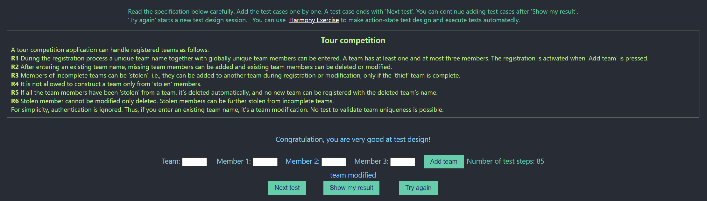

# Execution Report

**Project:** tour-competition  
**Tester:** Alexandr Gusev  
**Execution Period:** October 2026  
**Build Version:** 1.0

---

## Summary

| Metric           | Count |
|------------------|-------|
| Total test cases | 35    |
| Executed         | 35    |
| Pass             | 35    |
| Fail             | 0     |
| Blocked          | 0     |
| Pass rate        | 100%  |

---

## Execution Report

| Case  | Preconditions                                                     | Steps                                        | Expected message                  | Expected result                                                   | Status |
|-------|-------------------------------------------------------------------|----------------------------------------------|-----------------------------------|-------------------------------------------------------------------|--------|
| R1.1  | "a": {"1", "2", "3"}                                              | "b": {"4", "5", "6"}                         | new team inserted                 | "a": {"1", "2", "3"} "b": {"4", "5", "6"}                      | ✅      |
| R1.2  |                                                                   | "a": {"1", "", ""}                           | new team inserted                 | "a": {"1", "", ""}                                                | ✅      |
| R1.3  |                                                                   | "": {"1", "", ""}                            | Team name cannot be empty         | not created                                                       | ✅      |
| R1.4  | "a": {"1", "2", "3"}                                              | "b": {"1", "4", "5"}                         | all team members should be unique | "a": {"1", "2", "3"}                                              | ✅      |
| R1.5  |                                                                   | "a": {"1", "1", "2"}                         | members should be different       | not created                                                       | ✅      |
| R1.6  |                                                                   | "a": {"1", "2", "2"}                         | members should be different       | not created                                                       | ✅      |
| R1.7  |                                                                   | "": {"", "", ""}                             | At least one member is needed     | not created                                                       | ✅      |
| R2.1  | "a": {"1", "", ""}                                                | "a": {"1", "2", ""}                          | team modified                     | "a": {"1", "2", ""}                                               | ✅      |
| R2.2  | "a": {"1", "2", ""}                                               | "a": {"1", "2", "3"}                         | team modified                     | "a": {"1", "2", "3"}                                              | ✅      |
| R2.3  | "a": {"1", "", ""}                                                | "a": {"1", "2", "3"}                         | team modified                     | "a": {"1", "2", "3"}                                              | ✅      |
| R2.4  | "a": {"1", "", ""}                                                | "a": {"2", "", ""}                           | team modified                     | "a": {"2", "", ""}                                                | ✅      |
| R2.5  | "a": {"1", "2", "3"}                                              | "a": {"4", "5", "6"}                         | team modified                     | "a": {"4", "5", "6"}                                              | ✅      |
| R2.6  | "a": {"1", "2", ""}                                               | "a": {"", "2", ""}                           | team modified                     | "a": {"", "2", ""}                                                | ✅      |
| R2.7  | "a": {"1", "2", "3"}                                              | "a": {"", "", "3"}                           | team modified                     | "a": {"", "", "3"}                                                | ✅      |
| R3.1  | "a": {"1", "2", ""}                                               | "b": {"1", "3", "4"}                         | new team inserted                 | "a": {"", "2", ""} "b": {"1", "3", "4"}                        | ✅      |
| R3.2  | "a": {"1", "2", ""}                                               | "b": {"1", "3", ""}                          | only complete team can stole      | "a": {"1", "2", ""}                                               | ✅      |
| R3.3  | "a": {"1", "2", "3"} "b": {"4", "", ""}                        | "b": {"4", "2", "3"}                         | all team members should be unique | "a": {"1", "2", "3"} "b": {"4", "", ""}                        | ✅      |
| R3.4  | "a": {"1", "2", ""} "b": {"3", "4", "5"}                       | "b": {"2", "4", "6"}                         | team modified                     | "a": {"1", "", ""} "b": {"2", "4", "6"}                        | ✅      |
| R4.1  | "a": {"1", "2", "3"}                                              | "b": {"1", "2", "3"}                         | all team members should be unique | "a": {"1", "2", "3"}                                              | ✅      |
| R4.2  | "a": {"1", "2", ""} "b": {"3", "4", ""} "c": {"5", "6", ""} | "d": {"1", "4", "5"}                         | All members cannot be 'stolen'    | "a": {"1", "2", ""} "b": {"3", "4", ""} "c": {"5", "6", ""} | ✅      |
| R5.1  | "a": {"1", "", ""}                                                | "b": {"1", "2", "3"}                         | new team inserted                 | "a" deleted "b": {"1", "2", "3"}                               | ✅      |
| R5.2  | "a": {"1", "2", ""}                                               | "b": {"1", "2", "3"}                         | new team inserted                 | "a" deleted "b": {"1", "2", "3"}                               | ✅      |
| R5.3  | "a": {"", "2", "3"}                                               | "b": {"1", "2", "3"}                         | new team inserted                 | "a" deleted "b": {"1", "2", "3"}                               | ✅      |
| R5.4  | "a": {"1", "", ""} "b": {"1", "2", "3"}                        | "a": {"4", "5", "6"}                         | deleted team name cannot be used  | "a" deleted "b": {"1", "2", "3"}                               | ✅      |
| R6.1  | "a": {"1", "", ""} "b": {"1", "2", "3"}                        | b: {"4", "2", "3"}                           | Stolen member cannot be modified  | "a" deleted "b": {"1", "2", "3"}                               | ✅      |
| R6.2  | "a": {"1", "2", ""} "b": {"1", "2", "3"}                       | b: {"1", "2", "4"} b: {"5", "2", "4"}     | Stolen member cannot be modified  | "a" deleted b: {"1", "2", "4"}                                 | ✅      |
| R6.3  | "a": {"", "2", "3"} "b": {"1", "2", "3"}                       | b: {"1", "2", "4"}                           | Stolen member cannot be modified  | "a" deleted "b": {"1", "2", "3"}                               | ✅      |
| R6.4  | "a": {"1", "2", "3"} "b": {"4", "5", ""}                       | "a": {"4", "2", "3"} "a": {"6", "2", "3"} | Stolen member cannot be modified  | "a": {"4", "2", "3"} "b": {"", "5", ""}                        | ✅      |
| R6.5  | "a": {"1", "", ""} "b": {"1", "2", "3"}                        | "b": {"", "2", "3"}                          | team modified                     | "a" deleted "b": {"", "2", "3"}                                | ✅      |
| R6.6  | "a": {"", "1", ""} "b": {"1", "2", "3"}                        | "b": {"1", "2", ""} "c": {"3", "1", "4"}  | new team inserted                 | "a" deleted "b": {"1", "2", ""} "c": {"3", "1", "4"}        | ✅      |
| R6.7  | "a": {"1", "", "3"} "b": {"1", "2", "3"}                       | "b": {"1", "2", ""} "b": {"1", "2", "4"}  | new team inserted                 | "a" deleted "b": {"1", "2", ""} "c": {"3", "1", "4"}        | ✅      |
| R6.8  | "a": {"", "2", "3"} "b": {"4", "5", "3"}                       | "a": {"3", "2", ""}                          | all team members should be unique | "a": {"", "2", ""} "b": {"4", "5", "3"}                        | ✅      |
| R6.9  | "a": {"", "2", "3"} "b": {"4", "2", "5"}                       | "a": {"", "6", "3"}                          | team modified                     | "a": {"", "6", "3"} "b": {"4", "2", "5"}                       | ✅      |
| R6.10 | "a": {"1", "2", ""} "b": {"3", "2", "4"}                       | "a": {"1", "5", ""}                          | team modified                     | "a": {"1", "5", ""} "b": {"3", "2", "4"}                       | ✅      |
| R6.11 | "a": {"1", "2", ""} "b": {"1", "2", "3"}                       | "b": {"", "2", "3"} "b": {"4", "2", "3"}  | team modified                     | "a" deleted "b": {"4", "2", "3"}                               | ✅      |

## Result
